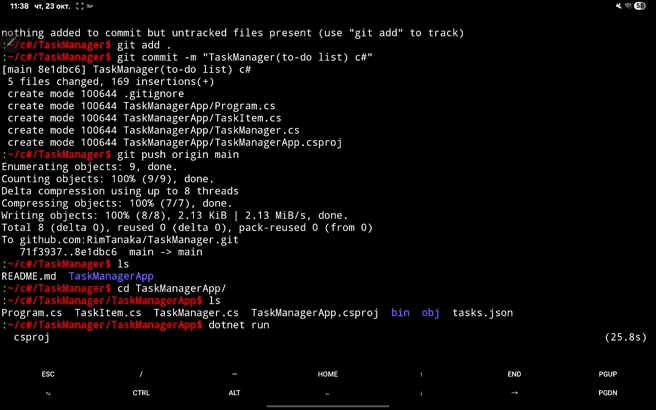

# TaskManagerApp — консольный менеджер задач на C#

## Описание проекта

**TaskManagerApp** — консольное приложение для управления списком задач (To-Do list), написанное на языке **C#**.

Все операции выполняются через меню в терминале, а данные сохраняются в локальный файл `tasks.json` в формате **JSON**.

---

## Основные возможности

+ Добавление новой задачи
+ Просмотр всех задач
+ Отметка задачи как выполненной
+ Удаление задачи
+ Автоматическое сохранение и загрузка задач из `tasks.json`

---

## Как работает программа

При запуске:
1. Программа проверяет наличие файла `tasks.json`.
2. Если файла нет — создаётся пустой список задач.
3. Пользователю отображается меню:
-----------------------------------------
|1. Добавить задачу                     |
|2. Показать все задачи                 |
|3. Отметить задачу как выполненную     |
|4. Удалить задачу                      |
|5. Выйти                               |
-----------------------------------------
4. После каждого действия список сохраняется в JSON

